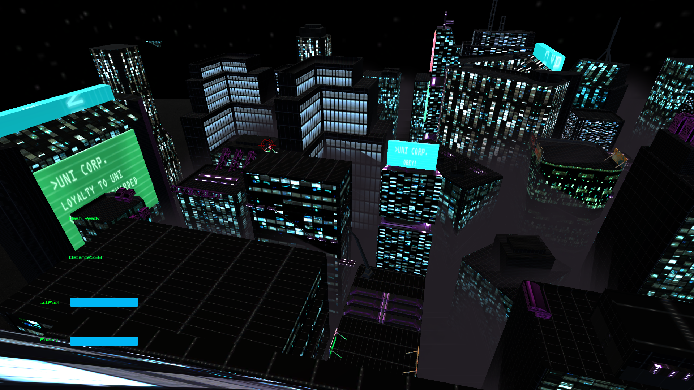

# SKYE

## ABOUT
Skye is a short video game, focused on atmosphere and movement mechanics. It was developed as a group project for Computer Graphics and Game Techonology course on University of Ljubljana, Faculty of Computer and Information Science.

You play as a rebel operative in a dystopian future city. Catch the Uni. Corp drone, marked on your HUD to win the game. 

## CONTROLS

movement: WASD keys

jump: space

jetpack: hold space after jumping. Collect orange cans to refill your energy.

dash: F

sprint: shift

wallrun: sprint next to a wall

## HOW TO PLAY
Download skyeWindows.rar file and extract it. Run skyeWindows.exe to play the game. 

## CREDITS

Game idea: Peter Colaric

Programming:

  -player controller: Rok Petrovcic Vižintin

  -AI, GUI: Matic Cešarek

  -bug fixes: Ivan Antešic

Level Design, Modeling, Textures: Ivan Antešic

Fog: Peter Colaric

music: LeviDoron - "Watch Dogs Remix" 

This game is not meant to be sold, it was created for educational purposes only.
